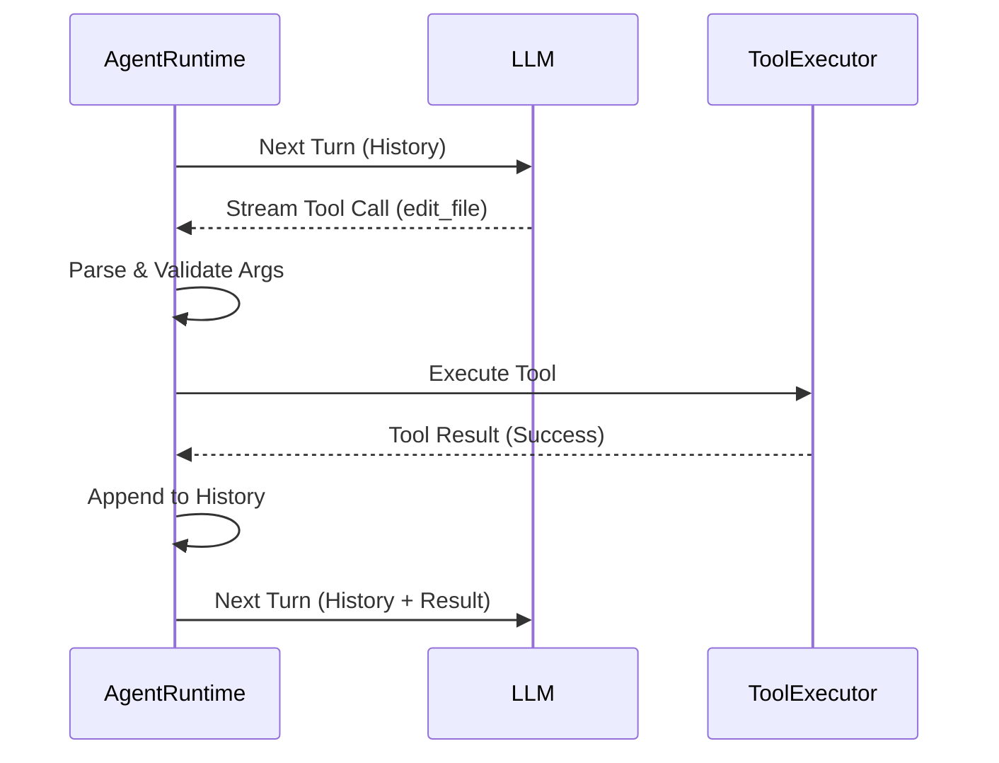

# AI Agent Runtime Analysis

This document provides a deep-dive engineering analysis of the AI agent's internal runtime mechanics, focusing on the execution loop, tool coordination, and event pipeline.

---

## 1. Complete Execution Lifecycle

The lifecycle begins with a user prompt and ends when the task is explicitly submitted or an unrecoverable error occurs.

### Trace (User Prompt to Finish)
1.  **Frontend Entry:** User clicks "Send" in the VS Code sidebar or hits Enter in the CLI TUI.
2.  **Request Packaging:** The UI sends a message (via gRPC in VS Code or local call in CLI) to the **Controller**.
3.  **Session Start/Continue:**
    -   In VS Code, `SdkController.askResponse` is called.
    -   It delegates to `SdkFollowupCoordinator` or `SdkTaskStartCoordinator`.
    -   These call `ClineCore.send()` (for continue) or `ClineCore.start()` (for new task).
4.  **SDK Orchestration:** `LocalRuntimeHost.runTurn()` locates the `ActiveSession`.
5.  **Agent Execution:** `SessionRuntime.run()` or `continue()` is called.
6.  **The Loop:** `AgentRuntime.execute()` starts the Think-Act cycle (detailed in Section 3).
7.  **Completion:** The agent calls the `submit_and_exit` tool.
8.  **Finalization:** `LocalRuntimeHost.finalizeSingleRun()` shuts down the session and saves final history.

---

## 2. Call Hierarchy

### Top-Level Chain
- `SdkController.askResponse`
  - `SdkFollowupCoordinator.askResponse`
    - `ClineCore.send`
      - `LocalRuntimeHost.runTurn`
        - `LocalRuntimeHost.executeTurn`
          - `SessionRuntime.continue`
            - `SessionRuntime.executeRun`
              - `AgentRuntime.continue`
                - `AgentRuntime.execute` (The Loop)

### Key Function Details

| Function | Purpose | Parameters | Returns | Side Effects |
| :--- | :--- | :--- | :--- | :--- |
| `AgentRuntime.execute` | Core loop logic. | `input` (prompt) | `AgentRunResult` | Updates internal message history, emits events. |
| `generateAssistantMessage` | LLM call & parsing. | None | `{message, finishReason}` | Calls LLM, parses streaming chunks into tool-calls. |
| `executeToolCalls` | Runs tools in parallel/serial. | `toolCalls[]` | `AgentMessage[]` | Executes filesystem/terminal actions. |
| `prepareTurn` | Hook for custom logic. | `context` | `PreparedTurn` | Can modify system prompt or history before LLM call. |

---

## 3. Agent Loop (Think -> Plan -> Tool -> Observe)

The loop resides in `AgentRuntime.execute()` and operates as follows:

1.  **Wait for Turn:** Increments `iteration` count.
2.  **Think/Plan:** Calls `generateAssistantMessage()`.
    -   LLM is prompted with the full history and system rules.
    -   LLM responds with a strategy and one or more tool calls.
3.  **Tool (Act):** Calls `executeToolCalls()`.
    -   Checks policy (Auto-approve vs Manual).
    -   Calls `tool.execute()` for each approved call.
4.  **Observe:** Captures the output of the tools (stdout, file content, errors).
5.  **Continue:**
    -   If tools were executed, the results are added to history, and the loop returns to step 1.
    -   If the LLM provided a final answer without tools, or called `submit_and_exit`, the loop terminates.
6.  **Guardrails:** The loop terminates if `maxIterations` is reached or the `MistakeTracker` triggers an abort.

---

## 4. Prompt Construction

Prompt assembly is a multi-stage process involving several files.

-   **System Prompt Template:** `sdk/packages/shared/src/prompt/system.ts`. Contains hardcoded "Rules of Engagement".
-   **Dynamic assembly:** `sdk/packages/shared/src/prompt/cline.ts` (`buildClineSystemPrompt`).
    -   Injects `{{PLATFORM_NAME}}`, `{{IDE_NAME}}`, `{{CWD}}`.
    -   Inlines `.clinerules` via `{{CLINE_RULES}}`.
-   **Context Mentions:** `apps/vscode/src/core/mentions/index.ts` (`parseMentions`).
    -   Expands `@file`, `@problems`, `@git-changes` into raw text blocks *before* the prompt reaches the SDK.
-   **Tool Descriptions:** Generated dynamically from the Zod schemas in `sdk/packages/core/src/extensions/tools/schemas.ts`.
-   **History Injection:** `AgentRuntime` takes the array of `AgentMessage` objects from `ConversationStore` and passes them directly to the LLM vendor via `@cline/llms`.

---

## 5. Streaming Pipeline

Cline uses a delta-based streaming architecture to ensure the UI feels responsive.

1.  **Provider Chunk:** `anthropic.ts` (or other vendor) receives an SSE chunk.
2.  **LLM Delta:** `@cline/llms` emits `text-delta` or `tool-call-delta`.
3.  **Agent Event:** `AgentRuntime` accumulates deltas and emits `AgentRuntimeEvent` (e.g., `assistant-text-delta`).
4.  **Translation:** `SessionRuntime` uses `RuntimeEventAdapter` to map these to legacy `AgentEvent`s (e.g., `content_start`).
5.  **Host Stream:** `LocalRuntimeHost` (via `AgentEventBridge`) pushes these to the `SdkController`.
6.  **UI Update:**
    -   **VS Code:** `WebviewGrpcBridge` sends gRPC streaming responses over `postMessage`.
    -   **CLI:** `getUIEventEmitter` emits to the React TUI components.

---

## 6. Tool Call Detection & Parsing

### Detection
`AgentRuntime` monitors the LLM stream for specific tags or JSON structures (depending on the model's native tool-calling capability).

### Parsing
-   **Streaming Parsing:** `PendingToolAssembly` objects in `agent-runtime.ts` accumulate `tool-call-delta` chunks.
-   **Completion Parsing:** Once the stream finishes, `parseToolInput()` validates the collected arguments against the tool's Zod schema.

### Validation & Malformed Calls
-   If arguments fail Zod validation, `AgentRuntime` creates a "synthetic" tool error message.
-   This error is sent back to the LLM in the next iteration, allowing it to "fix" its own tool call.

---

## 7. Tool Execution Coordination

Coordinated in `LocalRuntimeHost.ts` and `executeToolCalls` in `AgentRuntime.ts`:

1.  **Policy Check:** `resolveToolPolicy` determines if a tool needs manual approval.
2.  **Approval Request:** `requestToolApproval()` sends a message to the UI and waits.
3.  **Executor Selection:** `createDefaultExecutors()` maps tool names to their implementations (e.g., `bash` tool -> `createShellExecutor`).
4.  **Node.js Handoff:** The executor (in `@cline/core`) performs the system call (e.g., `spawn` for bash).
5.  **Result Capture:** Stdout/stderr or file contents are captured, truncated if necessary, and returned as an `AgentToolResult`.

---

## 8. Conversation State

The `ConversationStore` (`sdk/packages/core/src/session/stores/conversation-store.ts`) is the source of truth.

-   **Atomic Updates:** History is updated *after every turn* and *after every tool result*.
-   **Persistence:** `LocalRuntimeHost` calls `persistSessionMessages` to save the JSON array to disk (`~/.cline/data/sessions/`).
-   **Snapshotting:** `createCoreSessionSnapshot` creates a UI-friendly version of the state for synchronization.

---

## 9. Error Handling & Recovery

| Failure Type | Recovery Mechanism |
| :--- | :--- |
| **Invalid Tool Call** | Runtime generates a system message describing the schema error; LLM retries in next iteration. |
| **Provider Failure** | `SdkController` catches API errors (401, 429, 500) and emits `api_req_failed`, rendering a "Retry" button. |
| **Streaming Break** | If the stream disconnects, the iteration is marked as "error", and the user is prompted to resume. |
| **Mistake Loop** | `MistakeTracker` counts consecutive errors. At the limit (default 6), it forces an abort or sends a "Recovery Notice" to change strategy. |
| **User Cancellation** | `AgentRuntime.abort()` sends a SIGKILL to child processes and interrupts the LLM stream. |

---

## 10. Extension Points for Customization

### Replace Planning Algorithm
Modify `AgentRuntime.execute()` loop. Currently, it's a simple sequential loop. You could introduce parallel planning branches or Monte Carlo tree search here.

### Add Reasoning Steps
The `beforeModel` hook in `AgentRuntimeHooks` allows injecting "Chain of Thought" messages into history before the LLM sees the main prompt.

### Multi-Agent Collaboration
Extend `sdk/packages/core/src/extensions/tools/team/`. Implement a "Coordinator" tool that spawns sub-instances of `AgentRuntime` with different system prompts.

### Add RAG
Implement a `search_docs` tool in `@cline/core/extensions/tools/executors/`. This tool would query your vector DB and return text blocks.

### Custom Memory
Modify `ConversationStore.ts` to implement a "Working Memory" summary that persists alongside the raw history.

---

## 11. Important Files Reference

| File | Responsibility |
| :--- | :--- |
| `sdk/packages/agents/src/agent-runtime.ts` | **The AI Brain.** Manages the Think-Act loop and stream parsing. |
| `sdk/packages/core/src/runtime/orchestration/session-runtime-orchestrator.ts` | **The Overseer.** Adds loop detection and mistake tracking to the brain. |
| `sdk/packages/core/src/runtime/host/local-runtime-host.ts` | **The Manager.** Handles persistence, start/stop, and tool implementation handoff. |
| `sdk/packages/llms/src/providers/gateway.ts` | **The Translator.** Normalizes LLM communication. |
| `apps/vscode/src/sdk/SdkController.ts` | **The Bridge.** Connects VS Code UI events to the SDK Core. |
| `sdk/packages/shared/src/prompt/system.ts` | **The Rules.** Definitive instructions for the AI. |

---

## 12. Sequence Diagrams

### Agent Loop (Success Path)


### Streaming Pipeline
```mermaid
graph LR
    API[Anthropic API] -->|SSE Chunk| LLM[@cline/llms]
    LLM -->|Text Delta| AR[AgentRuntime]
    AR -->|Runtime Event| SR[SessionRuntime]
    SR -->|Legacy Event| SC[SdkController]
    SC -->|gRPC/JSON| UI[React UI]
```

---

## 13. Risk Analysis

### Safe to Modify (Low Coupling)
- **`llms/src/providers/vendors/`**: Adding new AI models is isolated and safe.
- **`core/src/extensions/tools/executors/`**: Adding new tools is modular.
- **`webview-ui/src/components/`**: UI component changes (mostly) don't break the agent.

### Tightly Coupled (Change with Caution)
- **`SdkController.ts`**: Massive file. Changes here often cause ripple effects across the entire VS Code extension.
- **`agent-runtime.ts`**: The core loop. Small changes in parsing logic can break tool-calling for all models.
- **`protobus-services.ts`**: The gRPC bridge. Changing schemas requires updating both frontend and backend synchronously.
- **`ConversationStore.ts`**: Changing the message format requires careful migration of all existing user session files.
