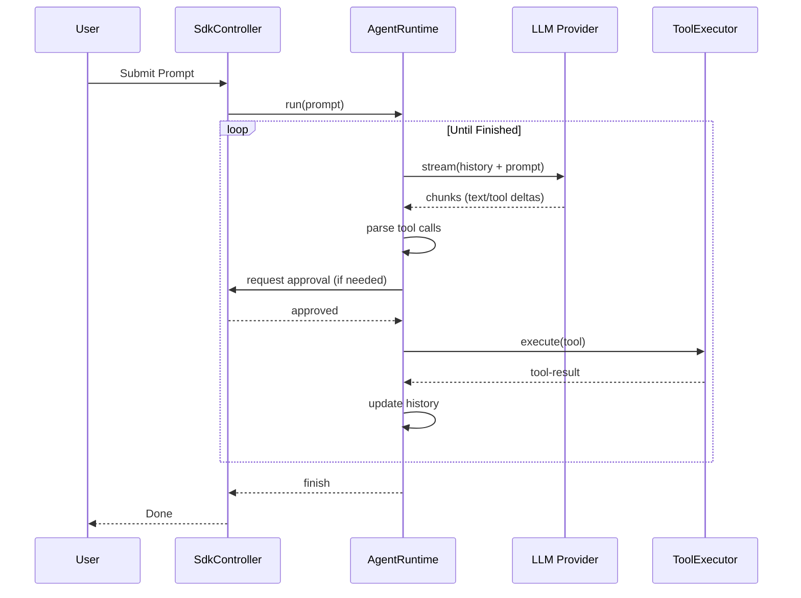
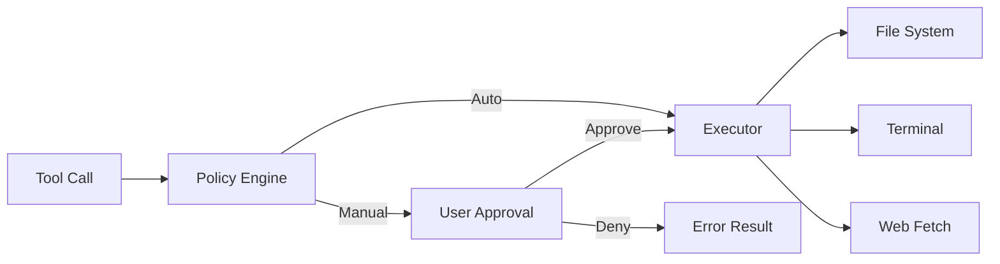
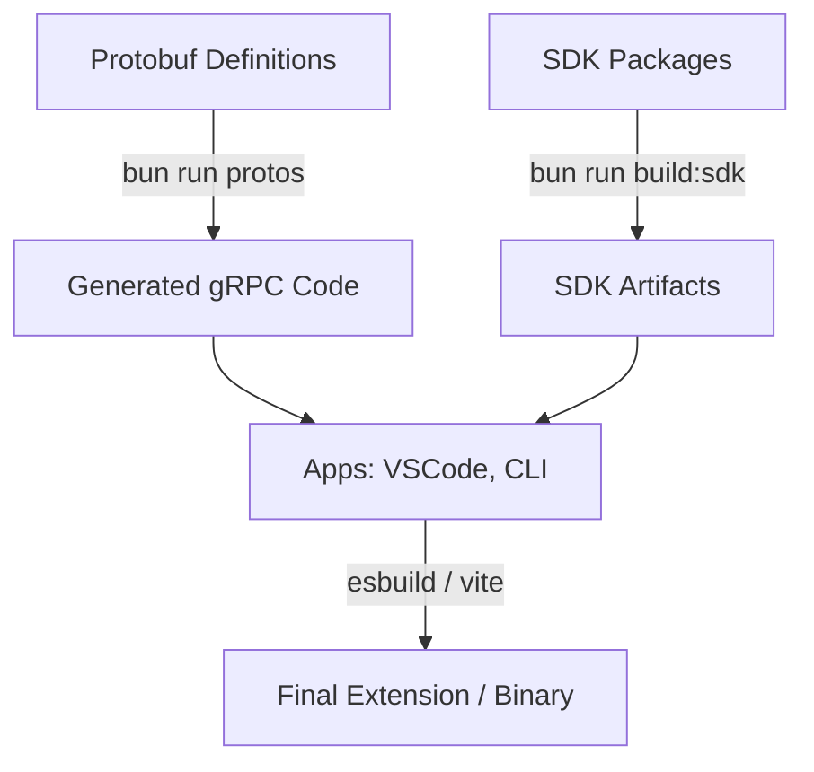

# Cline Architecture Report

**Date:** March 2024
**Author:** Software Architect Agent
**Purpose:** Comprehensive analysis of the Cline platform for future fork and evolution.

---

## 1. Project Overview

**Cline** is a state-of-the-art autonomous coding agent platform. It is designed to be cross-platform, sharing its "brain" (the SDK) across VS Code, JetBrains, and the CLI.

### Primary Purpose
To provide an autonomous AI pair programmer that can perform complex engineering tasks, including refactoring, feature implementation, and bug fixing, while maintaining strict user control over sensitive actions.

### Main Capabilities
- **Autonomous Iteration:** Uses LLMs to plan and execute multi-step tasks.
- **Precision Editing:** Edits files using diff-based patching to minimize context usage and prevent large-file overwrites.
- **Command Control:** Runs shell commands and reacts to their output (e.g., fixing a failing test).
- **Tool-Rich Environment:** Integrates with MCP servers, browser automation, and local file systems.
- **Human-in-the-Loop:** Every dangerous action (write, execute, web fetch) can be gated behind user approval.

### Design Philosophy
- **Consistency via SDK:** All business logic lives in the SDK packages to ensure the CLI and IDE extensions behave identically.
- **Safety First:** Default policies require approval for file writes and shell execution.
- **Platform Agnostic Core:** The agent loop doesn't know it's in VS Code; it talks to a `RuntimeHost` abstraction.

---

## 2. Folder Structure

### `sdk/packages/`
- **`core/`**: The session orchestration and implementation layer.
    - **Purpose:** Manages the lifecycle of an agent session, including state persistence, tool execution, and cost calculation.
    - **Responsibilities:** Implements `LocalRuntimeHost`, handles session history, manages tool executors (bash, editor, search).
    - **Dependencies:** `@cline/agents`, `@cline/llms`, `@cline/shared`.
    - **Important Files:** `ClineCore.ts` (Entry), `LocalRuntimeHost.ts` (Session Logic).
- **`agents/`**: The low-level AI agent loop.
    - **Purpose:** Encapsulates the core loop of sending prompts to an LLM and parsing tool calls.
    - **Responsibilities:** Prompt construction, LLM streaming, tool call validation, iteration management.
    - **Important Files:** `agent-runtime.ts` (The Loop logic).
- **`llms/`**: AI vendor abstraction.
    - **Purpose:** Provides a unified interface for multiple AI providers.
    - **Responsibilities:** Normalizes requests/responses for OpenAI, Anthropic, Google, etc. Handles streaming and token counting.
    - **Important Files:** `gateway.ts` (Factory), `handler.ts` (Interface), `vendors/` (Specific implementations).
- **`shared/`**: Shared types and utilities.
    - **Purpose:** Prevents code duplication across SDK and Apps.
    - **Responsibilities:** Zod schemas, prompt templates, ID generation, logging.

### `apps/`
- **`vscode/`**: The VS Code Extension.
    - **Purpose:** Integrates the Cline SDK into the VS Code environment.
    - **Responsibilities:** Command registration, Webview management, terminal integration, diff views.
    - **Important Files:** `extension.ts` (Entry), `SdkController.ts` (Adapter).
- **`vscode/webview-ui/`**: The Sidebar Frontend.
    - **Purpose:** React-based UI for the extension.
    - **Responsibilities:** Chat interface, model selection, settings UI.
- **`cli/`**: The CLI Tool.
    - **Purpose:** Headless and TUI-based agent execution.
    - **Responsibilities:** Argument parsing, TUI rendering (using OpenTUI), connection management.

---

## 3. Entry Points

### VS Code Extension
- **Activation:** `apps/vscode/src/extension.ts` -> `activate(context)`.
- **Startup Sequence:**
    1.  `setupHostProvider()`: Binds VS Code APIs to the `HostProvider`.
    2.  `initialize()`: Sets up `StateManager` (storage) and registers `VsCodeLmHandler`.
    3.  `VscodeWebviewProvider.resolveWebviewView()`: Mounts the React application.
- **Dependency Injection:** Done via the `HostProvider` singleton, which provides implementations for windowing, terminal, and workspace APIs.

### CLI
- **Binary:** `apps/cli/src/index.ts`.
- **Main:** `apps/cli/src/main.ts` -> `runCli()`.
- **Flow:**
    1.  Parse arguments using `commander`.
    2.  Check for piped input (headless mode).
    3.  If no command, launch `runInteractive()` (TUI mode).
    4.  Initialize `@cline/core` and start the session.

---

## 4. Architecture

### Overall Architecture Diagram
```mermaid
graph TD
    subgraph Client_Applications
        VSCode[VS Code Extension]
        CLI[CLI Tool]
        Hub[Cline Hub Dashboard]
    end

    subgraph SDK_Layer
        Core[@cline/core: Orchestration]
        Agents[@cline/agents: AI Loop]
        LLM[@cline/llms: AI Abstraction]
        Shared[@cline/shared: Utils]
    end

    subgraph Provider_Layer
        Vendors[Anthropic, OpenAI, etc.]
        MCP[MCP Servers]
    end

    VSCode -- gRPC/JSON --> Core
    CLI -- Direct Call --> Core

    Core --> Agents
    Agents --> LLM
    LLM --> Vendors
    Core --> Tools[Tool Executors]
    Tools --> MCP
    Tools --> LocalOS[File System / Terminal]
```

### Communication Flow
1.  **Frontend (React)** -> **Host (Node.js)**: Uses a custom gRPC-over-JSON implementation ("Protobus").
2.  **Host** -> **SDK**: The `SdkController` (VS Code) or `SessionRuntime` (CLI) acts as a high-level manager.
3.  **SDK Core** -> **LLM**: Sequential turns are managed by `AgentRuntime`.

---

## 5. Frontend Analysis

### Framework
- **React 19**: Modern React with Hooks.
- **OpenTUI**: CLI uses a specialized React reconciler to render components in the terminal.

### State Management
- **`ExtensionStateContext`**: Centralized context in `webview-ui` that mirrors the state of the backend.
- **Convergent Message Reducer**: `messageReducer.ts` uses timestamps and sequence numbers to ensure that streaming updates merge correctly even if delivered out of order.

### UI Styling
- **Tailwind CSS**: Used throughout the webview.
- **CSS Variables**: Deep integration with VS Code theme variables (`--vscode-*`).

---

## 6. Extension Analysis

### VS Code APIs
- **WebviewViewProvider**: Powers the sidebar.
- **TextDocumentContentProvider**: Used for virtual documents in diff views.
- **TerminalShellExecution**: Used to capture terminal output reliably.

### Webview Communication (gRPC)
- **Client:** `grpc-client-base.ts` (in webview-ui).
- **Handler:** `grpc-handler.ts` (in extension host).
- **Protocol:** Protobuf-defined messages serialized to JSON and sent via `postMessage`.

---

## 7. Core Engine

### AI Agent Loop (`AgentRuntime`)
The loop resides in `sdk/packages/agents/src/agent-runtime.ts`.

1.  **Preparation:** `callBeforeRunHooks()`.
2.  **Turn Start:** `generateAssistantMessage()`.
3.  **LLM Call:** Streams from the provider via `@cline/llms`.
4.  **Parsing:** Extracts text and `<tool_code>` (XML/JSON).
5.  **Policy Check:** Checks if the tool is auto-approved or requires manual intervention.
6.  **Tool Execution:** `executeToolCalls()` calls the implementation in `@cline/core`.
7.  **Result Integration:** Tool output is appended to conversation history.
8.  **Repeat:** Loops until `submit_and_exit` is called or `maxIterations` reached.

### Agent Execution Loop Diagram


---

## 8. AI Provider System

### Abstraction (`@cline/llms`)
The `ApiHandler` interface (`handler.ts`) defines the contract:
- `getMessages(systemPrompt, messages)`: Formats history for the specific vendor.
- `createMessage(systemPrompt, messages, tools)`: Starts a streaming completion.

### Adding a New Provider
1. Add vendor implementation in `sdk/packages/llms/src/providers/vendors/`.
2. Register in `sdk/packages/llms/src/providers/registry.ts`.
3. Update the frontend `ModelPicker` and backend `ProviderSettingsSchema`.

---

## 9. Tool System

### Registry
Tools are registered in `sdk/packages/core/src/extensions/tools/definitions.ts`.

### Tool Execution Flow


### Safety & Permissions
Policies are managed via `ToolPolicy` objects, which control `enabled` and `autoApprove` flags per tool.

---

## 10. File System

### Engine Implementation
Located in `sdk/packages/core/src/extensions/tools/executors/`.
- **`file-read.ts`**: Handles reading files with optional line limits.
- **`editor.ts`**: Handles writing.
- **`apply-patch.ts`**: Implements search-and-replace patching.

### Workspace Detection
Uses `resolveWorkspacePath` to ensure operations are confined to the intended directory.

---

## 11. Terminal System

### VS Code Integration
Uses `VscodeTerminalManager.ts`. It reuses existing terminals and monitors them via the `onDidStartTerminalShellExecution` event.

### CLI Execution
Uses `bash.ts`. It spawns a child process and implements a `RollingCollector` to ensure that only the most relevant parts of the output are sent to the LLM if the output is massive.

---

## 12. Sandbox

### Local Execution (Default)
Cline runs code directly on the user's machine. The "Sandbox" is enforced by:
1.  **User Approval**: Manual confirmation for every command.
2.  **Storage Isolation**: `CLINE_SANDBOX=1` forces storage into a temporary folder.

---

## 13. Prompt System

### Prompt Construction
Located in `sdk/packages/shared/src/prompt/`.
- **`system.ts`**: The main instructions. It is very long and detailed, covering every tool's usage rules.
- **`cline.ts`**: Dynamically builds the final system prompt by injecting environment info (OS, CWD, Date).
- **`format.ts`**: Handles XML-tag wrapping for `<user_input>` and `<user_command>`.

---

## 14. Memory

### Conversation Storage
Sessions are persisted as JSON files in `~/.cline/data/sessions/`. This allows resuming tasks after an IDE restart.

### Context Management
- **Compaction**: `SdkCompactionCoordinator` handles shrinking history.
- **Checkpoints**: High-level state snapshots that allow reverting the whole workspace.

---

## 15. Configuration

- **`settings.json`**: Global application settings (theme, telemetry, default model).
- **`providers.json`**: Encrypted API keys and model selections.
- **`.clinerules`**: Project-specific instructions that are automatically added to the system prompt.

---

## 16. Networking

- **Protocol**: HTTPS for LLM APIs.
- **Streaming**: SSE (Server-Sent Events) for real-time deltas.
- **Auth**: Bearer tokens or OAuth (via `AuthService`).

---

## 17. Branding

**Branding Touchpoints (Search & Replace targets):**
- **App Name**: `Cline`, `Claude Dev`.
- **Publisher**: `saoudrizwan`.
- **Extension ID**: `saoudrizwan.claude-dev`.
- **Icons**: `assets/icons/icon.png`, `apps/vscode/assets/icon.svg`.
- **Marketplace Metadata**: `apps/vscode/package.json`.
- **URLs**: `cline.bot`, `docs.cline.bot`.
- **CLI Binary**: `cline`.

---

## 18. Build System

### Build Pipeline Diagram


### Key Scripts
- `bun run build`: Full repo build.
- `bun run dev`: Launches VS Code extension in debug mode.

---

## 19. Dependency Graph

- **`zod`**: Schema validation for all boundaries.
- **`commander`**: CLI framework.
- **`opentui`**: Terminal UI framework.
- **`nice-grpc`**: gRPC communication logic.
- **`esbuild`**: Fast bundling.

---

## 20. Extension Points

### For New Capabilities
- **AI Providers**: Add to `@cline/llms/vendors`.
- **Custom Tools**: Add to `@cline/core/extensions/tools/executors`.
- **Hooks**: Implement the `AgentRuntimeHooks` interface to intercept events.
- **Slash Commands**: Add to `SdkController.resolveSlashCommands`.

---

## 21. Risks

- **Coupling**: `SdkController` is a massive adapter that connects almost every system. Changes here are high risk.
- **gRPC Overhead**: The Protobus system, while type-safe, adds significant boilerplate for simple UI changes.
- **Resource Usage**: Large file reads or long terminal outputs can quickly exhaust the LLM's context window.

---

## 22. Improvement Opportunities

- **Plugin System**: Move from hardcoded tools to a dynamic plugin registry.
- **Isolation**: Add optional Docker/VM support for command execution.
- **Testing**: Improve unit test coverage for `AgentRuntime` edge cases (e.g., malformed tool calls).

---

## 23. Modification Guide

### To Rebrand as a New Product
1.  **Metadata**: Update `package.json` in root and `apps/vscode/`.
2.  **Branding**: Replace all logos in `assets/`.
3.  **IDs**: Change the extension ID and publisher in `apps/vscode/package.json`.
4.  **CLI**: Rename the binary entry in `apps/cli/package.json`.

### To Alter the Agent Workflow
- Modify `AgentRuntime.execute()` in `sdk/packages/agents/src/agent-runtime.ts`. This is where the core logic of Plan -> Act loop lives.

---

## 24. Repository Map

```text
.
├── apps/
│   ├── cli/             # CLI application logic & TUI
│   ├── vscode/          # VS Code extension host
│   │   ├── src/         # Extension host logic (SdkController)
│   │   └── webview-ui/  # Sidebar UI (React)
│   └── cline-hub/       # Multi-session dashboard
├── sdk/
│   └── packages/
│       ├── agents/      # Core AI loop (AgentRuntime)
│       ├── core/        # Session & Tool implementation (ClineCore)
│       ├── llms/        # Vendor abstractions (Gateway)
│       └── shared/      # Common code, types, and prompts
├── assets/              # Logos and icons
└── docs/                # Public documentation
```

### Control Flow Map
`Webview UI` -> `Protobus` -> `SdkController` -> `ClineCore` -> `AgentRuntime` -> `LLM Provider` -> `AgentRuntime` -> `Tool Executor` -> `ClineCore` -> `Webview UI`.
