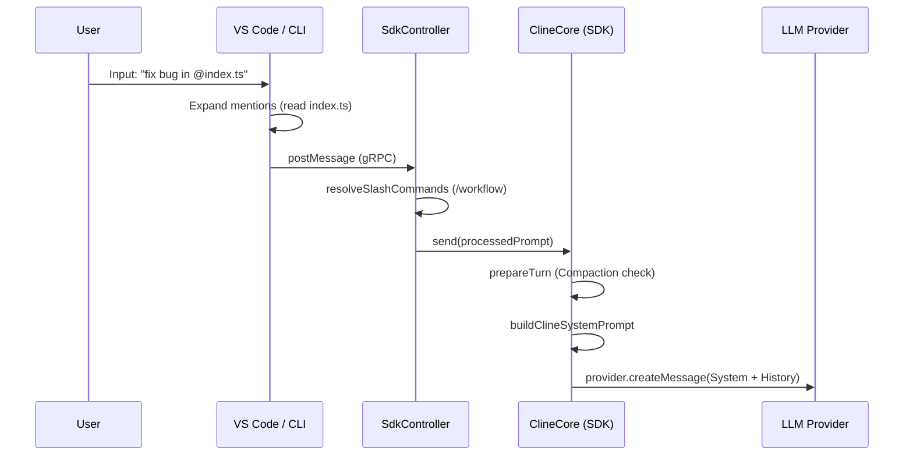
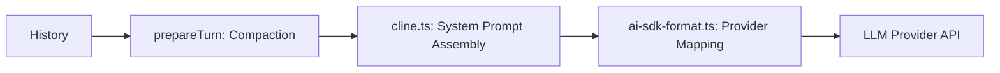

# Prompt System Analysis

This document provides a deep-dive reverse-engineering analysis of the Cline Prompt System, covering template management, dynamic context injection, and provider-specific message formatting.

---

## 1. Prompt Architecture

The prompt system is distributed across the SDK and client applications, following a layered approach:

| File | Layer | Responsibility |
| :--- | :--- | :--- |
| `shared/src/prompt/system.ts` | **Template** | Static system prompt definitions for standard and YOLO modes. |
| `shared/src/prompt/cline.ts` | **Assembly** | Combines system templates with environment-specific dynamic data. |
| `apps/vscode/src/core/mentions/` | **Context** | Expands `@` mentions into raw text blocks before sending to the SDK. |
| `core/src/extensions/config/` | **Rules** | Loads and merges `.clinerules`, workflows, and custom instructions. |
| `shared/src/llms/ai-sdk-format.ts` | **Format** | Translates internal message structures into vendor-specific API formats. |

---

## 2. Prompt Lifecycle



---

## 3. System Prompt Generation

The system prompt is the "Rules of Engagement" for the agent.

### Generation Process (`cline.ts`)
- **Template Selection:** Chooses between `DEFAULT_CLINE_SYSTEM_PROMPT` and `YOLO_CLINE_SYSTEM_PROMPT`.
- **Environment Injection:** Replaces placeholders:
  - `{{PLATFORM_NAME}}`: e.g., "darwin", "win32".
  - `{{IDE_NAME}}`: e.g., "VS Code".
  - `{{CWD}}`: The absolute path of the current workspace.
  - `{{CURRENT_DATE}}`: Current system date.
- **Rules Injection:** Replaces `{{CLINE_RULES}}` with merged contents of `.clinerules` and global instructions.
- **Metadata Injection:** Replaces `{{CLINE_METADATA}}` with JSON-serialized workspace information (branch name, commit hash, etc.).

---

## 4. User Prompt Processing

Before reaching the model, the raw user text is enriched:

1.  **Normalization:** `normalizeUserInput` strips existing XML tags used internally.
2.  **Slash Command Expansion:** `/workflow name` is replaced with the full instruction text from the corresponding workflow file.
3.  **Mention Expansion:** `@file.ts` is replaced with a block like `<file_content path="...">...</file_content>`.
4.  **multimodal Content:** Images are attached as base64 data parts (in VS Code) or paths (in CLI).

---

## 5. Conversation History & Compaction

History management ensures the LLM stays within its context window.

- **Storage:** `ConversationStore` maintains an array of `AgentMessage` objects.
- **Compaction Strategies (`compaction.ts`):**
    -   **Basic:** Simple truncation of the oldest messages.
    -   **Agentic:** Uses a secondary LLM call to summarize the early part of the conversation into a single "summary" message.
- **Token Budgeting:** `createTokenEstimator` uses character-count heuristics or provider-specific tokenizers to decide when to trigger compaction.

---

## 6. Project Rules (`.clinerules`)

The system aggregates instructions from multiple sources:
1.  **Global Instructions:** Configured in VS Code settings.
2.  **Workspace Instructions:** The `.clinerules` file in the root directory.
3.  **Dynamic Skills:** Files in `.cline/skills/` are loaded as persistent rules.
4.  **Priority:** Local `.clinerules` usually override global defaults during the merge process in `user-instruction-config-loader.ts`.

---

## 7. Tool Prompt Injection

### Schema Conversion
Tool definitions are derived from Zod schemas in `sdk/packages/core/src/extensions/tools/schemas.ts`.
- **Native Support:** For Anthropic/OpenAI, these are sent as `tools` in the API request.
- **Legacy/Custom:** For models without native tool calling, the agent runtime injects the tool descriptions and XML formatting instructions directly into the system prompt.

---

## 8. Prompt Templates Reference

| Template | File | Purpose |
| :--- | :--- | :--- |
| `DEFAULT_CLINE_SYSTEM_PROMPT` | `system.ts` | The primary persona and capability guide. |
| `YOLO_CLINE_SYSTEM_PROMPT` | `system.ts` | Instructions for background execution without user contact. |
| `formatFileContentBlock` | `format.ts` | Wraps file content for the model: `<file_content path="...">...</file_content>`. |
| `formatUserCommandBlock` | `format.ts` | Wraps shell output: `<user_command slash="...">...</user_command>`. |

---

## 9. Provider Formatting (`ai-sdk-format.ts`)

Different LLMs require different message structures:

-   **Anthropic:** Messages alternate `user` and `assistant`. Images must be hoisted to the top of the message parts.
-   **OpenAI:** Supports a `system` role. Tool results are sent in a separate `tool` role with `tool_call_id`.
-   **General Sanitization:** `sanitizeSurrogates` removes lone Unicode surrogates that cause JSON parsing errors in LLM vendor APIs.

---

## 10. Sequence Diagrams

### Context Injection Flow
```mermaid
graph TD
    User[User Input] --> MP[Mention Parser]
    MP -->|@file| FS[File System Read]
    MP -->|@terminal| TR[Terminal Output Buffer]
    MP -->|@problems| DX[Diagnostics Provider]
    FS & TR & DX --> XML[XML Content Blocks]
    XML --> SDK[SDK Start/Send]
```

### Final Request Construction


---

## 11. Important Files Reference

| File | Responsibility | Dependencies |
| :--- | :--- | :--- |
| `shared/src/prompt/cline.ts` | Final system prompt assembler. | `system.ts` |
| `apps/vscode/src/core/mentions/index.ts` | High-level context expansion. | `HostProvider`, `git.ts` |
| `core/src/extensions/context/compaction.ts` | History length management. | `llms/tokens.ts` |
| `shared/src/llms/ai-sdk-format.ts` | Wire-format transformation. | `llms/media.ts` |

---

## 12. Extension Points for Developers

### Custom Prompting Strategy
Modify `sdk/packages/shared/src/prompt/cline.ts`. You can change how templates are selected or how environment variables are mapped.

### Injecting RAG Context
The best place is in `apps/vscode/src/core/mentions/index.ts` (as a new `@` mention) or in a `beforeModel` hook in the SDK to inject retrieved chunks directly into history.

### Custom Workflow Prompts
Add new markdown files to `.cline/workflows/`. These are automatically discovered and expanded by the `UserInstructionConfigService`.

### Planning Prompts
Modify `sdk/packages/shared/src/prompt/system.ts`. The "Begin by analyzing..." section at the end of the template controls the initial planning phase of the agent.
