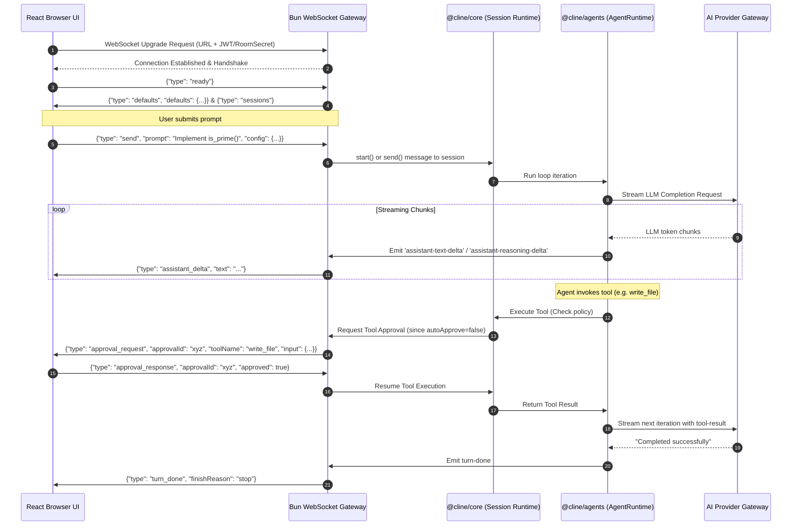
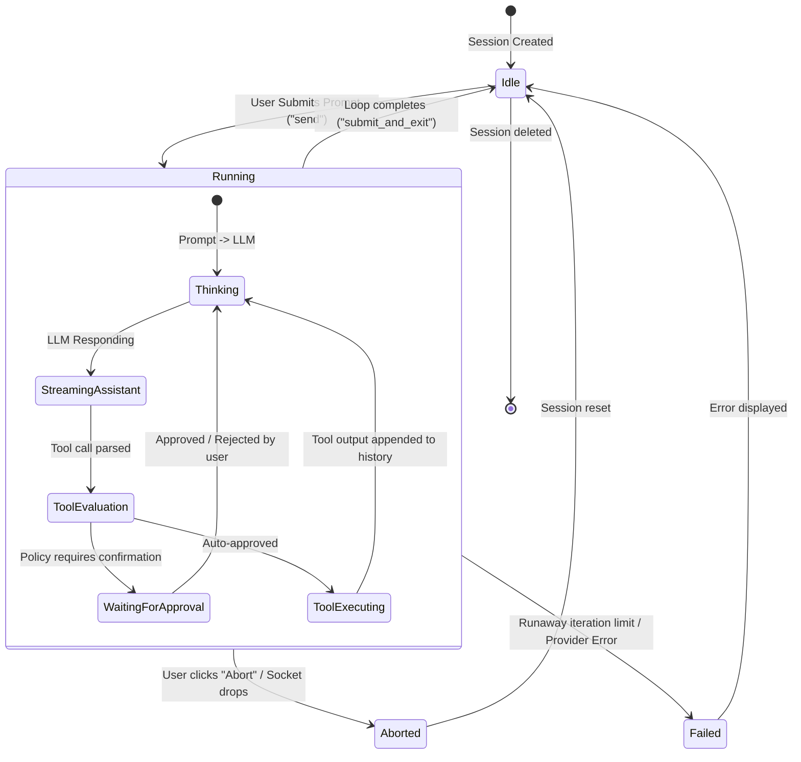
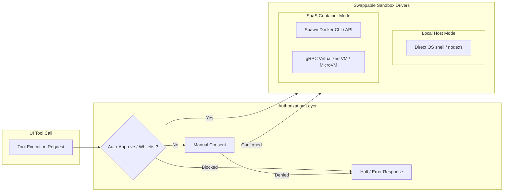

# 01-ARCHITECTURE-DIAGRAMS.md

## Architectural Diagrams & Structural Layout

This document visualizes the structural and runtime architecture of the transformed Cline Web Agent. It maps the overall components, the WebSocket communication protocol, the session state lifecycle, and the secure sandbox isolation layers.

---

## 1. High-Level Architecture

The web-based Cline architecture consists of three core tiers:
1. **Presentation Tier (Browser)**: A high-performance React application (modernized from `apps/cline-hub`) using Tailwind, Shadcn UI, and Lucide icons.
2. **Server Tier (Node/Bun)**: An orchestration server serving the SPA web assets, exposing REST endpoints for auth/settings, and hosting a WebSocket gateway to manage bidirectional streaming with `@cline/core`.
3. **Execution Tier (Sandbox)**: The compute environment where shell commands and file operations are carried out, which can be configured as a direct local host (for local development) or inside isolated Docker/MicroVM sandboxes (for cloud SaaS).

### Overall Architecture Diagram
```mermaid
graph TD
    subgraph Client_Tier [Client Tier: Web Browser]
        UI[React SPA: Apps/Cline-Hub Webview]
        WS_Client[WebSocket Client / RPC]
        State_Store[Zustand/Context: UI State]
    end

    subgraph Server_Tier [Server Tier: Bun/Node API Server]
        HTTP_Server[HTTP Webview Static & REST API]
        WS_Gateway[WebSocket Gateway & Event Multiplexer]
        Auth_MW[Auth Middleware: JWT / Local Pass]
        Core_Orch[@cline/core: Stateful Orchestrator]
        LLM_Adapter[@cline/llms: Provider Abstraction]
        DB_ORM[Drizzle ORM / SQLite / Postgres]
    end

    subgraph Sandbox_Execution_Tier [Sandbox Execution Tier]
        subgraph LocalHost [Local Mode]
            FS_Local[Local Workspace File System]
            Shell_Local[Local OS Shell / Bash]
        end
        subgraph SandboxMode [Isolated SaaS Mode]
            Docker_Cont[Isolated Docker Container]
            E2B_Sand[MicroVM / E2B Sandbox API]
        end
    end

    UI -->|Serve SPA Assets| HTTP_Server
    WS_Client <-->|Bidirectional WebSockets| WS_Gateway
    WS_Gateway -->|Authorize Session| Auth_MW
    WS_Gateway <-->|Control Sessions| Core_Orch
    Core_Orch -->|Database Operations| DB_ORM
    Core_Orch -->|Execute Shell/Files| Sandbox_Execution_Tier
    Core_Orch -->|Prompt & Stream Loops| LLM_Adapter
    LLM_Adapter <-->|HTTPS REST/Streaming| LLM_Vendors[AI LLM Vendors: Anthropic, OpenAI, OpenRouter]
```

### Description
* The **Client Tier** sends UI actions (messages, settings updates, manual tool approvals) via a stateful WebSocket connection.
* The **Server Tier** authenticates requests, logs messages to a persistent SQLite/Postgres DB via Drizzle ORM, and starts the `AgentRuntime` loop.
* The **Execution Tier** handles code read/write and script executions. It can run directly on the host machine or get spun up dynamically inside virtualized containers on demand.

---

## 2. Real-Time Communication & WebSocket Event Protocol

The WebSocket Gateway maintains bidirectional communication between the browser client and the running orchestrator. It uses a custom frame protocol passing type-safe JSON payloads.



### Description
* **Handshake (Steps 1-4)**: Prepares the browser client with loaded settings, providers, and previous session lists.
* **Prompt Loop (Steps 5-11)**: Initiates the agent's LLM generation, streaming token chunks directly back to the UI in real-time.
* **Human-In-The-Loop Approval (Steps 12-16)**: When a tool execution requires confirmation, the agent pauses, and a push notification is dispatched over the WebSocket. Once the user clicks "Approve", the server resumes tool execution and passes results back into the agent's LLM context.

---

## 3. Session State Lifecycle

The life of a user session moves through multiple state changes based on LLM outputs, user requests, and background schedules.



### Description
* **Thinking**: The model is formulating its thoughts and plan.
* **StreamingAssistant**: Text and thinking thoughts are streamed in real-time.
* **ToolEvaluation**: Determines if a tool should be blocked, auto-approved, or gated behind human consent.
* **WaitingForApproval**: Gated state awaiting WebSocket confirmation before executing physical code operations.

---

## 4. Secure Sandbox Systems

The execution architecture differs based on whether the application is run in **Local Mode** or **SaaS Mode**:



### Description
* **Local Host Mode**: Directly reads/writes utilizing `node:fs` and spawns standard shell subprocesses. Perfect for a local browser app running on localhost.
* **SaaS Container Mode**: The execution engine intercepts file/shell operations and wraps them. It either mounts a project directory into a lightweight Docker container or uploads changes into an E2B secure sandboxed MicroVM where bash and code run safely isolated from the host server.
